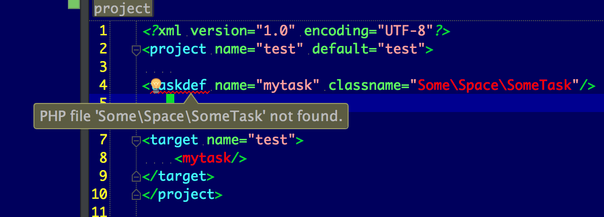

PhpStorm doesn't recognize the custom namespace task

If you open the `build.xml` it will show:
- *PHP file 'Some\Space\SomeTask' not found*
- the 'mytask' tag is an unresolved symbol

See this screenshot:


However, everything works fine for phing itself:
- `composer.phar install`
- `vendor/bin/phing`

Result in:
```
$ vendor/bin/phing
Buildfile: ..../build.xml

test > test:

Hello from namespaced task
```